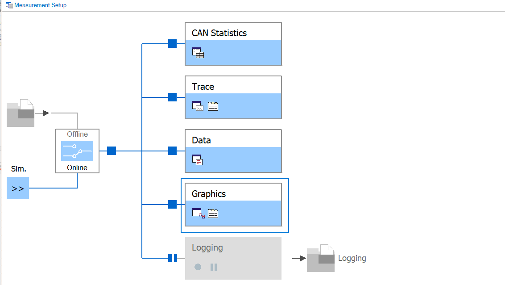
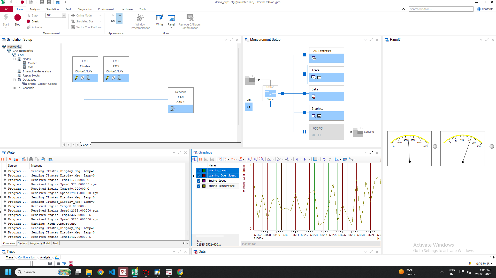
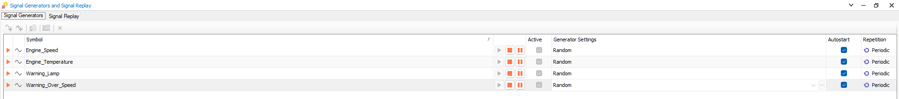
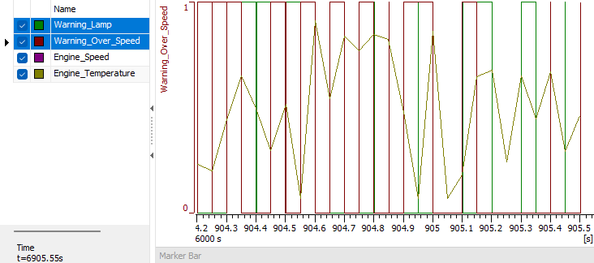
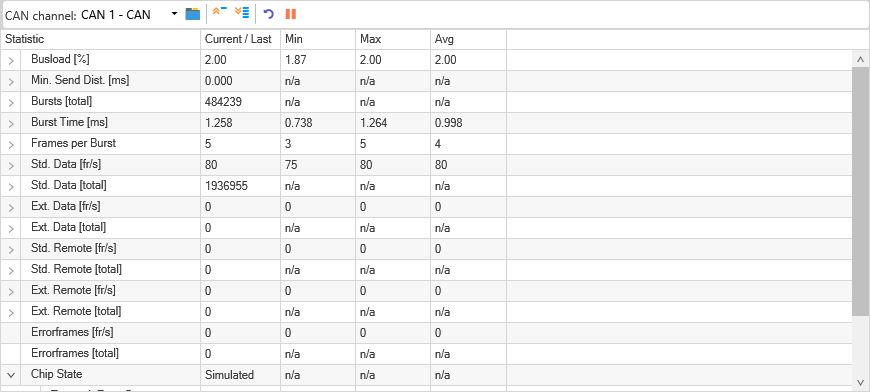
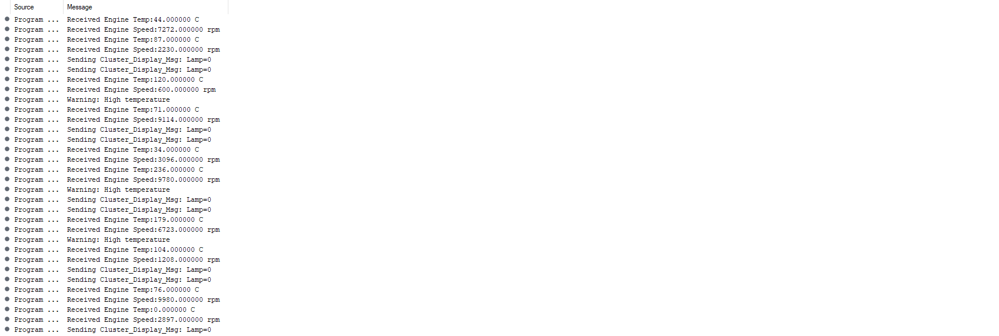
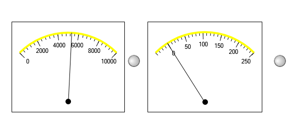

# 🚗 CANoe EMS–Cluster CAN Communication Simulation

> Simulating real-time CAN bus communication between an **Engine Management System (EMS) ECU** and an **Instrument Cluster ECU** using **Vector CANoe** and **CAPL**.


---

## 📌 Overview

**Objective:** Simulate communication between an EMS ECU and Instrument Cluster ECU using CAN messages and signals — receiving live engine data, evaluating threshold-based warnings, and transmitting the result back over the bus.

This project demonstrates a **basic Rx/Tx CAN communication setup** between two simulated ECUs — an EMS ECU and a Cluster ECU — built entirely in Vector CANoe. It covers the complete workflow of an automotive CAN network development task: designing the communication matrix, authoring the DBC, writing CAPL logic, injecting dynamic signal data, and validating the result through Trace and Graphics windows.

The Cluster ECU receives live engine data (speed and temperature) from the EMS ECU and raises **warning signals** — an over-temperature lamp and an over-speed warning — which are transmitted back over the bus and visualized in real time.

---

## 🎯 Objective

Simulate communication between the EMS ECU and Instrument Cluster ECU using CAN messages and signals, including:

- Receiving live `Engine_Speed` and `Engine_Temperature` data
- Evaluating threshold-based warning logic
- Transmitting warning states back to the cluster
- Visualizing signal behavior over time

---

## 🗂️ Communication Matrix

| Message | ID | Direction | Signals |
|---|---|---|---|
| `EMS_Data_Msg` | `0x100` | EMS → Cluster | `Engine_Speed`, `Engine_Temperature` |
| `Cluster_Display_Msg` | `0x101` | Cluster → EMS | `Warning_Lamp`, `Warning_Over_Speed` |

**Warning Logic:**
| Condition | Signal | Action |
|---|---|---|
| `Engine_Temperature > 110 °C` | `Warning_Lamp` | Set to `1` |
| `Engine_Speed > 6000 rpm` | `Warning_Over_Speed` | Set to `1` |

---

## 🛠️ Tools & Technologies

- **Vector CANoe /pro** — CAN network simulation environment
- **CAPL (CAN Access Programming Language)** — ECU behavior scripting
- **DBC (CAN Database)** — message/signal definitions
- **Signal Generators** — dynamic stimulus for engine parameters
- **Trace, Graphics & CAN Statistics windows** — real-time monitoring & validation

---

## ⚙️ Measurement Setup

The measurement chain routes simulated CAN traffic through CAN Statistics, Trace, Data, and Graphics blocks for full visibility into bus activity.



---

## 📡 Full CANoe Environment

The complete simulation setup — network topology (EMS & Cluster nodes on a simulated CAN bus), live Write window logs, and real-time Graphics plot of `Warning_Over_Speed` against time.



---

## 🎲 Signal Generation

`Engine_Speed`, `Engine_Temperature`, `Warning_Lamp`, and `Warning_Over_Speed` are driven using CANoe's built-in **Signal Generators**, configured with randomized/periodic profiles to continuously exercise the warning logic.

> Per the spec, `Engine_Temperature` can also be configured as a **Ramp**: Start = 20 °C, Stop = 120 °C, Period = 10 s — producing a smooth oscillation between the two bounds.



---

## 📈 Live Signal Trace

Warning transitions (`Warning_Lamp`, `Warning_Over_Speed`) plotted against `Engine_Speed` and `Engine_Temperature`, showing threshold-crossing behavior in real time.



---

## 📊 Bus Statistics

Real-time CAN bus health metrics — bus load, frame bursts, and standard data frame rates — confirming stable simulated bus traffic.



---

## 🖥️ Runtime Log (Write Window)

Console output showing received engine values and outgoing `Cluster_Display_Msg` transmissions as the CAPL logic evaluates each threshold.



---

## 🎛️ Gauge Visualization

Custom gauge panel showing live `Engine_Speed` and `Engine_Temperature` values as analog-style dials.



---

## 🧠 CAPL Logic Summary

The Cluster ECU's CAPL program:

1. Listens for `EMS_Data_Msg` on the bus
2. Extracts `Engine_Speed` and `Engine_Temperature`
3. Evaluates both warning conditions independently
4. Packs both warning signals into `Cluster_Display_Msg`
5. Transmits the message periodically via a 100 ms timer

```c
on message EMS_Data_Msg
{
  float temp = this.Engine_Temperature;
  float speed = this.Engine_Speed;

  $Warning_Over_Speed = (speed > 6000) ? 1 : 0;
  $Warning_Lamp        = (temp > 110)   ? 1 : 0;
}

on timer txTimer
{
  msg1.Warning_Lamp       = $Warning_Lamp;
  msg1.Warning_Over_Speed = $Warning_Over_Speed;
  output(msg1);
  setTimer(txTimer, 100);
}
```

📄 Full source: [`Engine_Cluster_Comms.can`](Engine_Cluster_Comms.can)

---

## 📁 Repository Structure

```
📦 canoe-ems-cluster-can-sim
├── Engine_Cluster_Comms.dbc      # CAN database (messages & signals)
├── Engine_Cluster_Comms.can      # CAPL source (Cluster ECU logic)
├── README.md                     # Project documentation
└── images/                       # Screenshots used in this README
```

---

## 🚀 How to Run

1. Open **Vector CANoe** (or CANoe /pro).
2. Load the project configuration and import `Engine_Cluster_Comms.dbc`.
3. Assign the CAPL node program (`Engine_Cluster_Comms.can`) to the **Cluster ECU** node.
4. Configure the **Signal Generators** for `Engine_Speed` and `Engine_Temperature` (Random or Ramp, per the spec above).
5. Start the measurement.
6. Observe warning transitions live in the **Trace**, **Graphics**, and **Write** windows.

---

## 📚 Key Learnings

- Designing a communication matrix and translating it into a working DBC
- Writing event- and timer-driven CAPL logic for ECU simulation
- Using Signal Generators to inject dynamic test stimulus
- Validating signal behavior using Trace, Graphics, and CAN Statistics windows

---

## 👤 Author

Feel free to connect if you'd like to discuss this project or automotive CAN/CAPL development in general.

---

⭐ If you found this project useful, consider starring the repo!
